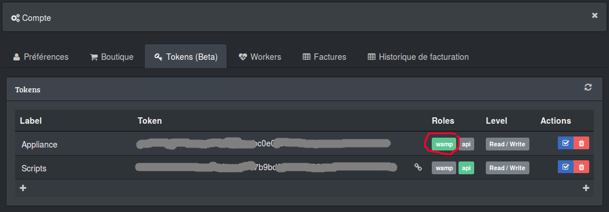

# checkmyws-python

[Check my Website](https://checkmy.ws) client for Python.

## REST api

### Setup environment

Install:
```
pip install checkmyws-python
```

Load module:
```
from checkmyws import CheckmywsClient

states = {
	-3: 'Disable',
	-2: 'Unschedule',
	-1: 'Pending',
	0:  'Ok',
	1:  'Warning',
	2:  'Down',
	3:  'Unknown'
}

```

### Public status (when you enable status page)
```
client = CheckmywsClient()

check = client.status('3887e18a-28d6-4eac-9eb0-c6d9075e4c7e')

print("%s (%s)" % (
	check['name'],
	check['url']
))

print(" + State: %s" % states[check['state']])

httptimes = check['lastvalues']['httptime'].items()
httptime = [v for k, v in httptimes]
httptime = int(sum(httptime) / len(httptime))

print(" + HTTP time: %s ms" % httptime)
for k, v in httptimes:
	print("   - %s: %s ms" % (k, v))
```

Output:
```
Check my Website (https://www.checkmy.ws/fr)
 + State: Ok
 + HTTP time: 70 ms
   - FR:PAR:GDI:DC: 70 ms
   - NE:AMS:DGO:DC: 115 ms
   - FR:GRA:OVH:DC: 27 ms
```

### Authed exemple

```
client = CheckmywsClient(
	login='<LOGIN>',
	token='<TOKEN>'
)

checks = client.checks()

for check in checks:
	print("%s (%s)" % (
		check['name'],
		check['url']
	))
    
	print(" + State: %s" % states[check['state']])
    
	httptimes = check['lastvalues']['httptime'].items()
	httptime = [v for k, v in httptimes]
	httptime = int(sum(httptime) / len(httptime))
    
	print(" + HTTP time: %s ms" % httptime)
	for k, v in httptimes:
		print("   - %s: %s ms" % (k, v))
        
	print('')
```

Output:
```
Console (https://console.checkmy.ws)
 + State: Ok
 + HTTP time: 140 ms
   - DE:FRA:VLR:DC: 80 ms
   - US:NY:DGO:DC: 328 ms
   - FR:GRA:OVH:DC: 12 ms

Check my Website (https://www.checkmy.ws/fr)
 + State: Ok
 + HTTP time: 81 ms
   - FR:PAR:GDI:DC: 73 ms
   - NE:AMS:DGO:DC: 129 ms
   - FR:GRA:OVH:DC: 41 ms

Wooster (https://wooster.checkmy.ws)
 + State: Ok
 + HTTP time: 213 ms
   - DE:FRA:VLR:DC: 93 ms
   - FR:PAR:GDI:DC: 36 ms
   - CA:BHS:OVH:DC: 511 ms

```


## WAMP api (BETA)

### Generate a token



### Setup a test environment

```
git clone -b live https://github.com/checkmyws/checkmyws-python.git
cd checkmyws-python
virtualenv python
source python/bin/activate
pip install -r requirements.txt
pip install service_identity pyOpenSSL twisted txaio autobahn
```

### Client

```
import logging
logging.basicConfig(level=logging.INFO)

from checkmyws.live import run, register


@register(".*")
def on_event(timestamp, check, procedure, location, worker, output):
    print("%s %s: %s %s %s", timestamp, check['_id'], procedure, location, output)

run(authid='<LOGIN>', secret='<TOKEN>')

```
